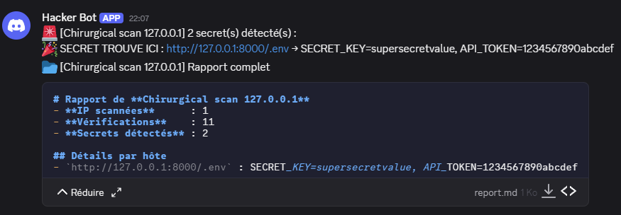

# Graal Forge Scanner

Un petit framework de scan HTTP “à la Graal” :  
- **Mass Scan** (`--mass`) sur un fichier / plage IP  
- **CIDR Scan** (`--cidr`) sur un CIDR  
- **Scan Chirurgical** (`--single IP`) sur une seule IP  

---

## 📦 Installation

1. Clone ce repo :  
   ```bash
   git clone git@github.com:PercevalFox/graal-forge-scanner.git
   cd graal-forge-scanner
   ```

2. Configure tes `config.*` (cf. ci‑dessous).

---

## ⚙️ Configuration

__Tous les fichiers `config.*`__ (dans `config.mass` / `config.cidr` / `config.single`) ont la même section `settings` :

```ini
# Pour mass
[settings]
# Webhook Discord pour alertes
discord_webhook_url = https://discord.com/api/webhooks/

# Pour cidr
[settings]
# Webhook Discord pour alertes
discord_webhook_url = https://discord.com/api/webhooks/

# Pour single
[settings]
# Webhook Discord pour alertes
discord_webhook_url = https://discord.com/api/webhooks/

```

---

## 🚀 Usage

Le script principal :  
```bash
./run_forge_graal.sh
```

Choisis ensuite :
1. **mass scan** → génère/charge `mass_targets.txt`, puis `--mass -r <ta_plage>`  
2. **cidr scan** → utilise `config.cidr` et `--cidr`  
3. **scan chirurgical** → `--single <IP>`

Le CLI te posera aussi :
- Chemin du **wordlist** (déjà présente dans le script)  
- Ports à scanner

Exemple complet pour un scan chirurgical :
```bash
=== Graal Forge Launcher ===
1) mass scan
2) cidr scan
3) scan chirurgical
> 3
IP pour scan chirurgical :
127.0.0.1
→ Utilisation de la config 'config.single'
Wordlist [wordlist.txt]:
Ports [80,443,8000,8001,8002,8080,8888,9090] (ajoute, sépare ','):
[🚀] Lancement --single 127.0.0.1…
🌐 Chirurgical scan 127.0.0.1 — 1 IP(s) → 11 vérifs → output: 'output_single/'
🎉 SECRET TROUVE ICI : http://127.0.0.1:8000/.env → SECRET_KEY=supersecretvalue, API_TOKEN=1234567890abcdef
🎉 Chirurgical scan 127.0.0.1 terminé. Report: 'output_single/report.md'
[✅] Scan terminé ! Consulte tes logs dans 'config.single'.
```
Le résultat sur Discord : 

---

## 📋 Résultat & Rapport

- **Dossiers de sortie** :  
  - `output_mass/…`  
  - `output_cidr/…`  
  - `output_single/…`  
- Chaque dossier contient un `report.md` listant tous les secrets par URL.
- Un message Discord te notifie et envoie directement `report.md`.

---

## 🧪 Environnement de test Docker

Un lab préconfiguré Docker est fourni dans `lab/` pour tester en local :

```bash
cd lab
docker-compose up --build -d
```

- Pour nettoyer : `docker-compose down`

---

## 🗒️ .gitignore recommandé

```
/output_cidr/
/output_mass*/
/output_single/
/rapport_discord/
```

---

## 🏷️ Licence & Auteurs

_Ce projet est fourni pour usage éducatif et de compréhension._  
Développé et pensé par **PercevalFox**.
